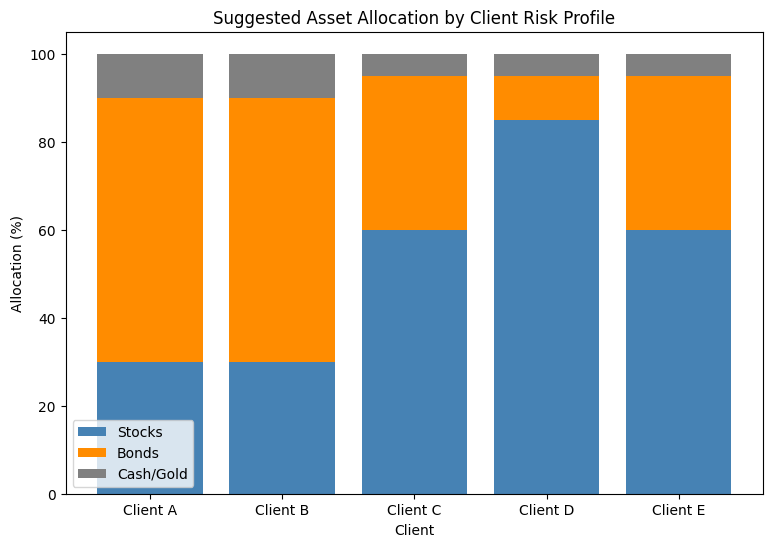
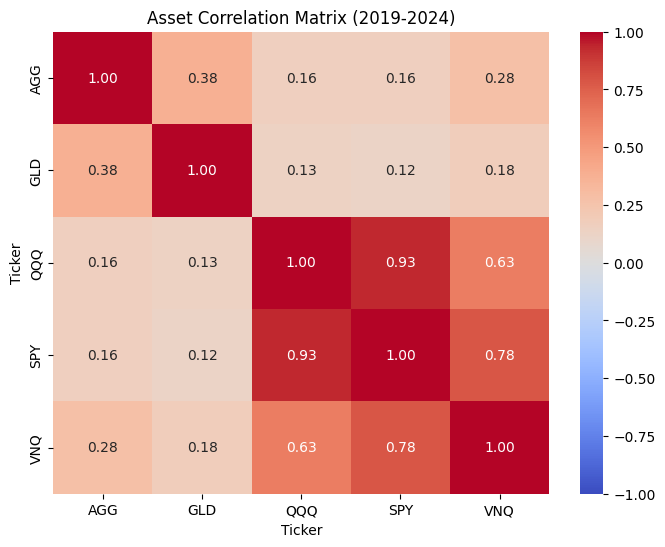
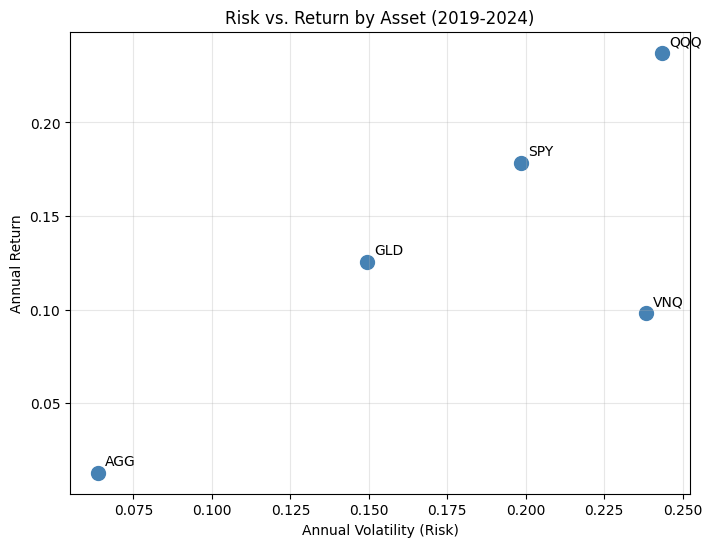
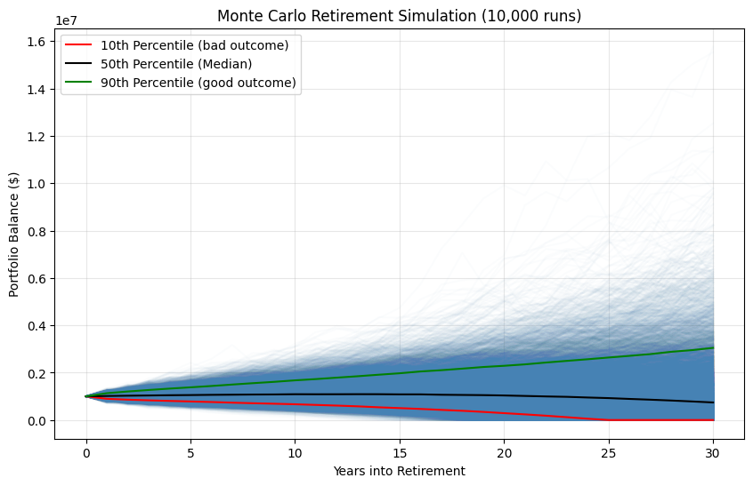

## Business Question

Given a client's risk profile, what asset allocation is appropriate — and what does that allocation actually mean for their odds of a successful 30-year retirement?

## Pipeline

### 1. Client Risk-Tolerance Scoring (`RiskTolerance.ipynb`)
A 6-question weighted questionnaire (time horizon, loss reaction, income stability, investing experience, primary goal, emergency savings) scores each client and classifies them into **Conservative / Moderate / Aggressive**, then maps that to a suggested stock/bond/cash split.

| Client | Score | Risk Category | Stocks % | Bonds % | Cash/Gold % |
|--------|-------|----------------|----------|---------|-------------|
| A | 6  | Conservative | 30% | 60% | 10% |
| B | 12 | Conservative | 30% | 60% | 10% |
| C | 17 | Moderate     | 60% | 35% | 5%  |
| D | 24 | Aggressive   | 85% | 10% | 5%  |
| E | 14 | Moderate     | 60% | 35% | 5%  |

### 2. Market Data Validation (`yFinance.ipynb`)
Rather than assuming stocks and bonds behave the way theory says they should, this stage pulls 2019–2024 daily price data (`yfinance`) for five asset classes — SPY, QQQ, AGG, GLD, VNQ — and computes real annual return, volatility, and correlation.

| Ticker | Annual Return | Annual Volatility | Sharpe Ratio |
|--------|---------------|--------------------|--------------|
| QQQ | 23.7% | 24.3% | 0.81 |
| SPY | 17.8% | 19.8% | 0.70 |
| GLD | 12.6% | 15.0% | 0.57 |
| VNQ | 9.8%  | 23.8% | 0.24 |
| AGG | 1.3%  | 6.4%  | -0.43 |

Key finding: SPY and QQQ are 0.93-correlated — holding both provides far less diversification than it appears to. AGG (bonds) is the only asset with a meaningfully low correlation to equities, confirming its role as the ballast in a conservative allocation.

### 3. Retirement Monte Carlo Simulation (`RetirementMonteCarloSimulation.ipynb`)
Takes a stock/bond allocation (from stage 1) and runs 10,000 simulated 30-year retirements against random annual market returns, testing how allocation and withdrawal rate together drive the odds of not running out of money.

**Baseline** (60% stocks, $1M starting balance, 4% withdrawal): **76.1%** success rate over 30 years.

**Success rate by withdrawal rate and stock allocation:**

| Withdrawal Rate | 40% Stocks | 60% Stocks | 80% Stocks |
|---|---|---|---|
| 3% | 97.2% | 95.5% | 92.8% |
| 4% | 70.1% | 75.4% | 76.0% |
| 5% | 27.3% | 44.9% | 51.6% |

Key finding: at a conservative 3% withdrawal rate, *lower* stock allocation actually produces a higher success rate — extra volatility isn't rewarded when you're barely drawing down principal. But at a 5% withdrawal rate, more stock exposure meaningfully improves outcomes, since the higher expected return compounds enough to outpace the aggressive withdrawals. The "right" allocation depends entirely on how much a client plans to spend, not on risk tolerance alone — a nuance the questionnaire in stage 1 doesn't capture on its own.

## Tools

- **Python** (`pandas`, `numpy`) — questionnaire scoring, simulation engine
- **yfinance** — historical market data retrieval
- **matplotlib / seaborn** — all visualizations
- **Jupyter / Google Colab** — development environment

## Repo Structure

## How to Run

Each notebook runs independently in Google Colab or Jupyter with no local setup — all dependencies install in the first cell. To reproduce the full pipeline in order:

1. Run `RiskTolerance.ipynb` to generate client risk scores and allocations
2. Run `yFinance.ipynb` to pull current market data and validate return/risk assumptions
3. Run `RetirementMonteCarloSimulation.ipynb`, passing a `stock_allocation` value from step 1 (and optionally the return/volatility figures from step 2 in place of the default assumptions) to project retirement outcomes

## Possible Extensions

- Replace the Monte Carlo's fixed `stock_mean_return`/`stock_std` assumptions with the actual computed values from `yFinance.ipynb`, so the simulation is driven entirely by real historical data
- Add a SQL layer for storing client profiles and simulation results
- Build a simple Power BI or Streamlit front end so a client's questionnaire answers flow straight through to their personalized retirement projection
